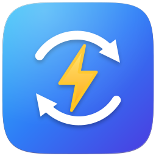
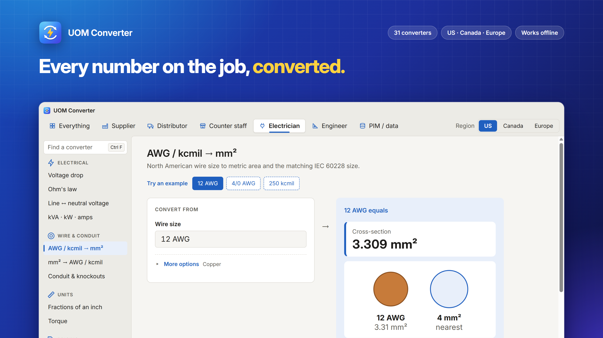
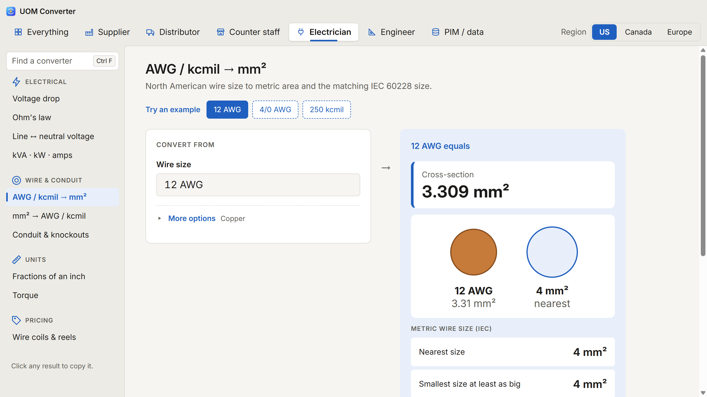
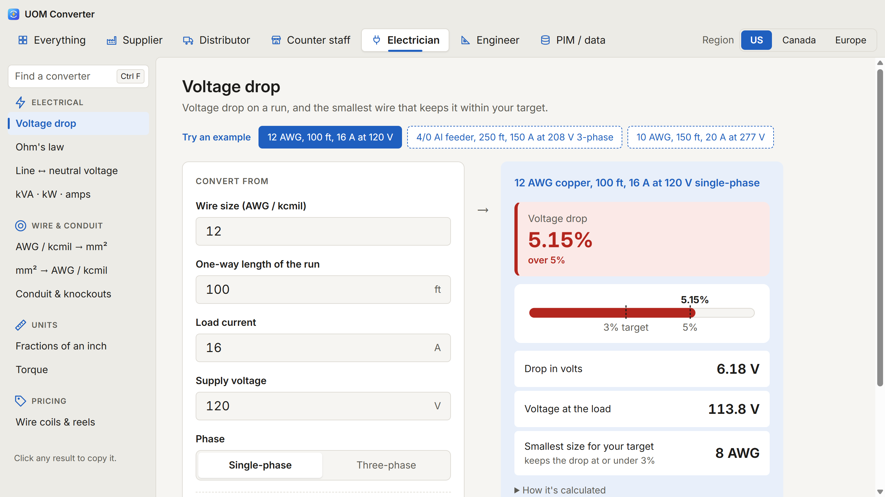
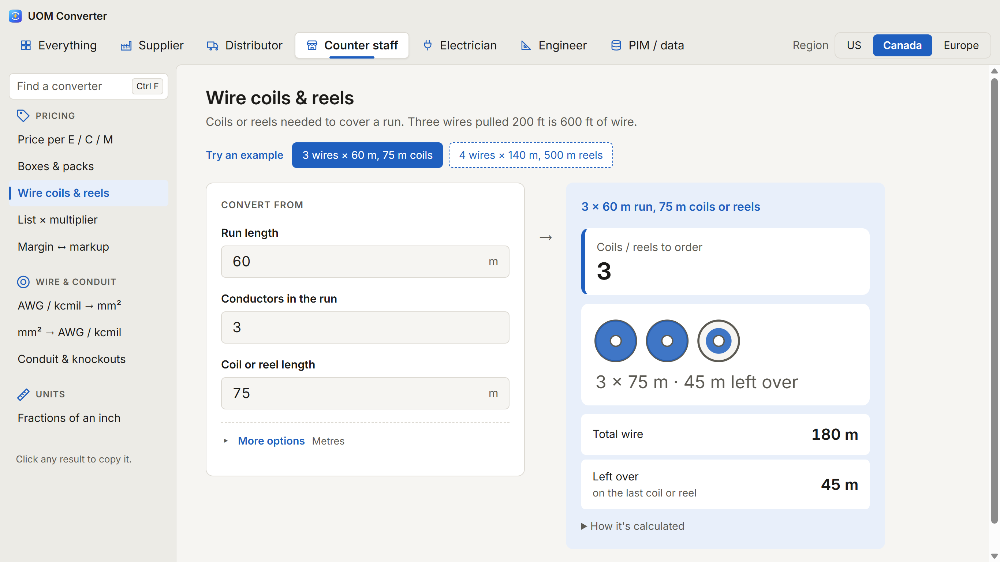

<div align="center">

  <br>

  </a>

  <h1>UOM Converter - Unit Converter for Electrical Industry</h1>

  

</div>

## Screenshots





## Quick start

```
npm install
npm test           # unit tests
npm run typecheck
```

Links open a specific view: `?for=engineer&region=eu#vdrop`.

## Windows app (.exe)

The same page, wrapped in Electron (`src/electron/main.cjs`). It is served from a private `app://`
scheme, with no Node access in the page, a sandboxed renderer and a content security policy.

```
npm run app        # build the page and open it in the desktop shell
npm run dist:win   # release/UOM-Converter-Setup-<version>.exe and a portable .exe
```

## Microsoft Store (.appx)

The Store build is an MSIX package. Partner Center signs it on submission, so it needs no
certificate of its own.

```
npm run store:assets   # re-render the app icon and store/ from app-icon.svg and the built page
npm run dist:store     # release/UOM-Converter-<version>.appx
```